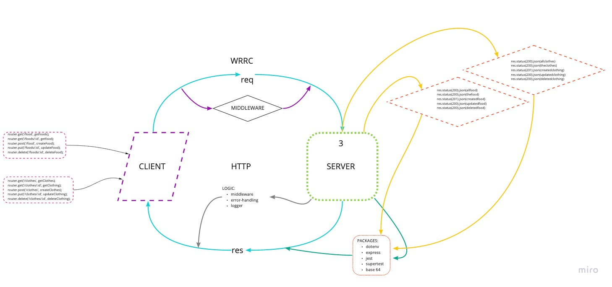

# Lab - Class 04

## Project: APU Server

### Author: Jason Taisey

### Links and Resources

https://github.com/JTaisey389/api-server/pulls

https://github.com/JTaisey389/api-server/actions

https://api-server-lab-03.herokuapp.com/

### Setup
* PORT - Port Number
* MONGODB_URI - MongoDB URI

### How to initialize/run your application
1. clone to local repo
2. npm install
3. npm start

### Tests
* Run tests with NPM test

## UML/WRRC

